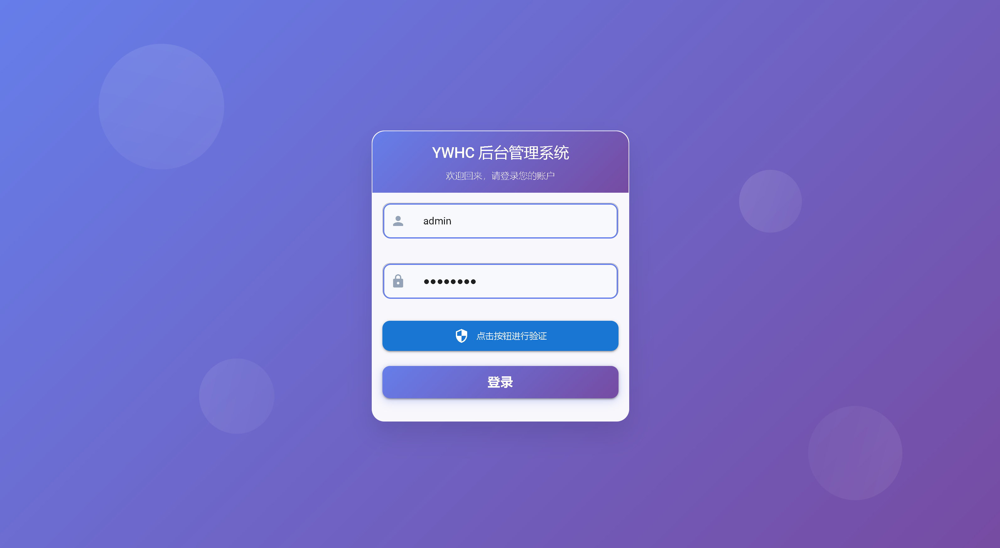
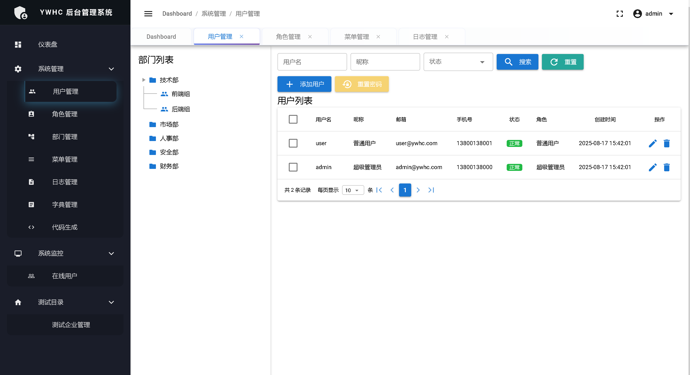
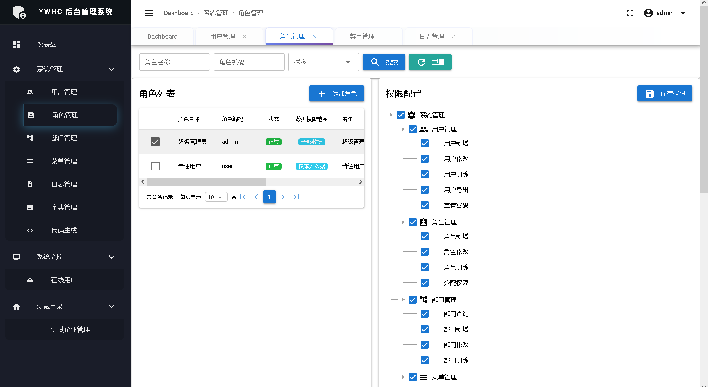
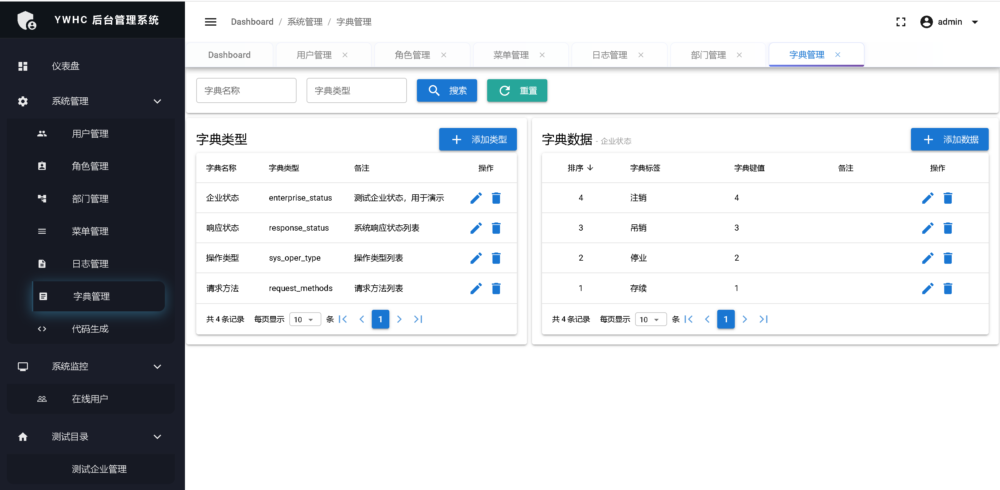
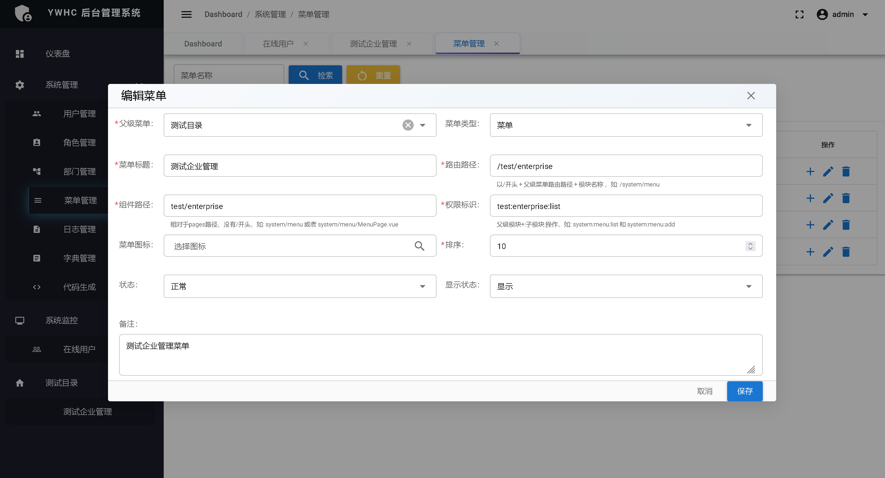
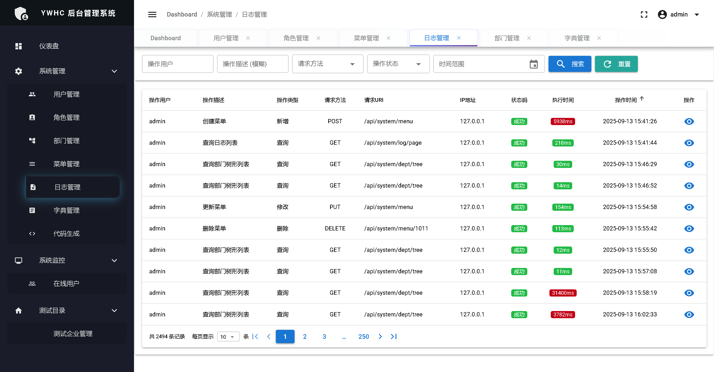
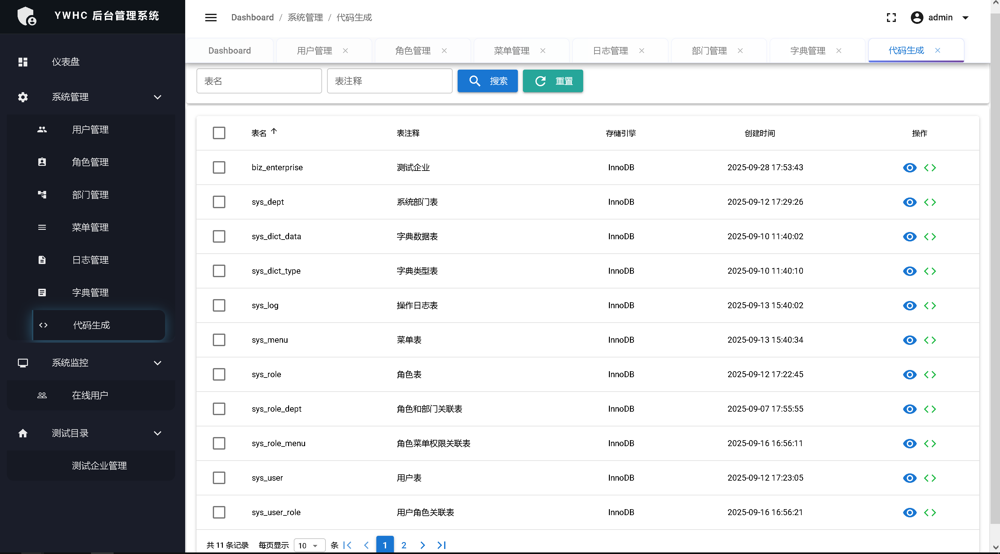
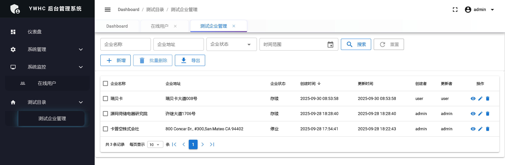

## Project Introduction - Frontend

A modern enterprise-level frontend management system built with Vue 3 + Quasar Framework v2 UI framework.

## 🌐 Language / 语言

**English** | [中文](README.md)

## 🔗 Quick Navigation

| Project | Description | Link |
|---------|-------------|------|
| 🖥️ **Backend Project** | Spring Boot Backend Service | [ywhc-admin-backend](https://github.com/RandolphChin/ywhc-admin-backend.git) |
| 🌐 **Frontend Project** | Vue3 + Quasar Frontend Application | [ywhc-admin-frontend](https://github.com/RandolphChin/ywhc-admin-frontend.git) |

## 📋 Features

- 👥 **User Management** - User configuration with default password admin123
- 🏢 **Department Management** - Organizational structure management with tree table format
- 🎯 **Role & Permissions** - Flexible RBAC permission control
- 📊 **Data Permissions** - Data scope control (All/Department/Department & Sub/Personal Only)
- 📋 **Menu Management** - Dynamic menu configuration with frontend dynamic menu routing
- 🔐 **Authentication & Authorization** - JWT-based security authentication system
- 📝 **Operation Logs** - Complete system operation audit
- 📚 **Data Dictionary** - System configuration management
- 🖼️ **Slide Captcha** - Secure graphical verification
- 📈 **Online User Monitoring** - Real-time user status management
- 📊 **Code Generation** - Code preview, download, and generate frontend/backend code

## 🛠️ Tech Stack

- **Vue 3** 3.4.18 - Progressive JavaScript framework
- **Quasar Framework** 2.6.0 - Vue.js component library and framework
- **Vue Router** 4.0.12 - Official routing manager
- **Pinia** 2.1.7 - State management library
- **Vite** - Modern build tool
- **Axios** 1.6.0 - HTTP client
- **go-captcha-vue** 2.0.6 - Slide captcha component
- **jsencrypt** 3.5.4 - RSA encryption library

## 📋 Requirements

### Required Environment
- **Node.js** 18.0+ or higher
- **npm** 8.0+ or **yarn** 1.21.1+
- **Modern Browsers** (Chrome 87+, Firefox 78+, Safari 13.1+, Edge 88+, IE not supported)

## 🚀 Quick Start

### 1. Clone Project
```bash
git clone https://github.com/your-org/ywhc-admin.git
cd ywhc-admin/ywhc-admin-frontend
```

### 2. Install Dependencies
```bash
# Using npm
npm install

# Or using yarn
yarn install
```

### 4. Start Development Server
```bash
# Development mode
npm run dev
# or
yarn dev

# Application will start at http://localhost:3000
```

## 📁 Project Structure

```
ywhc-admin-frontend/
├── public/                  # Static resources
│   └── icons/              # Application icons
├── src/
│   ├── api/                # API interface definitions
│   │   ├── monitor/        # Monitoring related APIs
│   │   │   └── online/     # Online user APIs
│   │   ├── system/         # System management APIs
│   │   │   ├── dept/       # Department management APIs
│   │   │   ├── generator/  # Code generation APIs
│   │   │   ├── log/        # Log management APIs
│   │   │   ├── menu/       # Menu management APIs
│   │   │   ├── role/       # Role management APIs
│   │   │   └── user/       # User management APIs
│   │   ├── test/           # Test related APIs
│   │   │   └── enterprise/ # Enterprise test APIs
│   │   ├── auth.js         # Authentication APIs
│   │   ├── dict.js         # Dictionary APIs
│   │   └── stats.js        # Statistics APIs
│   ├── boot/               # Quasar boot files
│   │   ├── auth.js         # Authentication configuration
│   │   ├── axios.js        # HTTP request configuration
│   │   ├── directives.js   # Directives configuration
│   │   ├── pinia.js        # State management configuration
│   │   └── router.js       # Router configuration
│   ├── components/         # Common components
│   │   ├── DataTablePagination.vue  # Data table pagination
│   │   ├── DictSelect.vue           # Dictionary selector
│   │   ├── IconSelector.vue         # Icon selector
│   │   └── SlideCaptcha.vue         # Slide captcha
│   ├── css/                # Style files
│   │   ├── themes/         # Theme styles
│   │   │   └── modern-theme.scss    # Modern theme
│   │   ├── app.scss        # Main style file
│   │   ├── detail-edit-common.scss  # Detail edit common styles
│   │   └── quasar.variables.scss    # Quasar variables
│   ├── directives/         # Custom directives
│   │   └── permission.js   # Permission directive
│   ├── layouts/            # Page layouts
│   │   └── MainLayout.vue  # Main layout
│   ├── pages/              # Page components
│   │   ├── monitor/        # System monitoring pages
│   │   │   └── online/     # Online user monitoring
│   │   ├── system/         # System management pages
│   │   │   ├── dept/       # Department management
│   │   │   ├── dict/       # Dictionary management
│   │   │   ├── generator/  # Code generation
│   │   │   ├── log/        # Log management
│   │   │   ├── menu/       # Menu management
│   │   │   ├── role/       # Role management
│   │   │   └── user/       # User management
│   │   ├── DashboardPage.vue        # Dashboard page
│   │   ├── ErrorNotFound.vue        # 404 page
│   │   ├── LoginPage.vue            # Login page
│   │   └── ProfilePage.vue          # Profile page
│   ├── router/             # Router configuration
│   │   ├── dynamicRoutes.js         # Dynamic routes
│   │   ├── index.js        # Main router file
│   │   └── routes.js       # Static route definitions
│   ├── stores/             # Pinia state management
│   │   └── auth.js         # Authentication state management
│   ├── utils/              # Utility functions
│   │   ├── crypto.js       # Encryption utilities
│   │   ├── dict.js         # Dictionary utilities
│   │   └── index.js        # Common utilities
│   ├── App.vue             # Root component
│   └── README.md           # Source code documentation
├── images/                 # System screenshots
├── .env.development        # Development environment configuration
├── .env.production         # Production environment configuration
├── .eslintrc.js           # ESLint configuration
├── .gitignore             # Git ignore file
├── index.html             # HTML entry file
├── package.json           # Project dependencies configuration
├── quasar.config.js       # Quasar configuration file
└── README.md              # Project documentation
```

## 📸 System Screenshots

### Login Interface


### User Interface


### Role Interface


### Dictionary Interface


### Menu Interface


### Log Interface


### Code Generation Feature


### Business Example


## 📄 License

This project is open source under the MIT License - see the [LICENSE](LICENSE) file for details.

## 🙏 Acknowledgments

Thanks to the following open source projects:
- [Vue.js](https://vuejs.org/) - Progressive JavaScript framework
- [Quasar Framework](https://quasar.dev/) - Vue.js component library

---

⭐ If this project helps you, please give me a Star!
